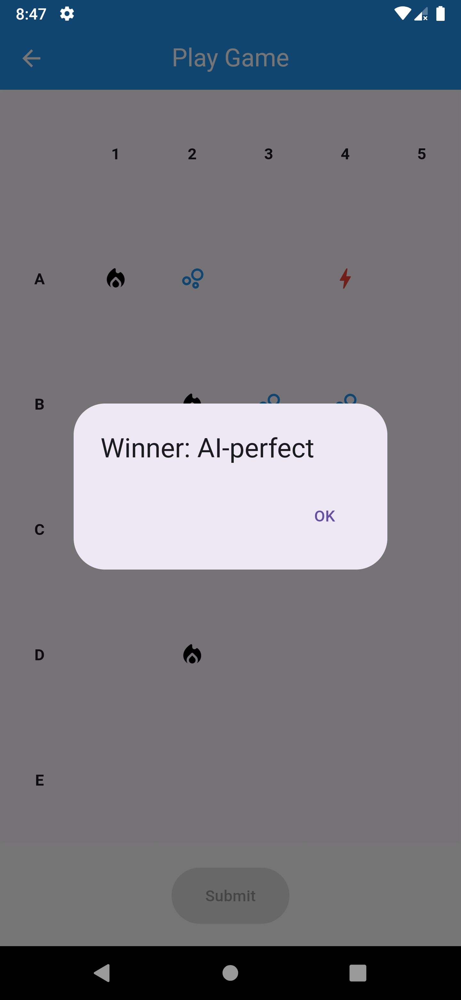

# Battleships Game Flutter

Battleships Game Flutter is a mobile application developed using Flutter that allows users to register, log in, and play the classic game of Battleships against both human and computer opponents. The application integrates with a RESTful API for user authentication and game management.

## Features

- **User Authentication**: Register and log in with persistent session tokens.
- **Game Management**: List ongoing and completed games, start new games with human or AI opponents, and delete games.
- **Gameplay**: Place ships on a 5x5 grid, play turns, and see real-time updates of game status and results.

## Screenshots
<div>


   





</div>

## Getting Started

To get started with the Battleships Game Flutter application, follow the instructions below.

### Prerequisites

- Flutter installed on your local machine.
- Access to the Battleships RESTful API.

### Installation

1. Clone the repository:
    ```bash
    git clone https://github.com/Mahmood-Anaam/Battleships-Game-Flutter.git
    cd Battleships-Game-Flutter
    ```

2. Install dependencies:
    ```bash
    flutter pub get
    ```

3. Configure the API:
    - Add your API base URL in the necessary configuration files.

### Running the App

To run the app on an emulator or physical device, use the following command:
```bash
flutter run
```

## Libraries Used

- `http`: For making HTTP requests to the RESTful API.
- `shared_preferences`: For storing session tokens and user preferences.
- `provider`: For state management.

## REST API Documentation

The Battleships REST API service can be accessed at the base URL `http://165.227.117.48`. All routes that require body content accept JSON data, and all responses are JSON objects. Here are some key endpoints:

### Authentication

- **Register**: `POST /register`
    - Request body: `{ "username": "your_username", "password": "your_password" }`
    - Response: `{ "message": "User created", "access_token": "token" }`

- **Login**: `POST /login`
    - Request body: `{ "username": "your_username", "password": "your_password" }`
    - Response: `{ "message": "Logged in", "access_token": "token" }`

### Managing Games

- **List Games**: `GET /games`
    - Response: `{ "games": [ ... ] }`

- **Start Game**: `POST /games`
    - Request body: `{ "ships": ["A1", "A2", "A3", "A4", "A5"], "ai": "random" }`
    - Response: `{ "id": "game_id", "player": 1, "matched": true }`

- **Game Details**: `GET /games/{game_id}`
    - Response: `{ "id": "game_id", "status": 0, "position": 1, "turn": 1, "player1": "user1", "player2": "user2", "ships": ["A1"], "wrecks": ["A2"], "shots": ["A3"], "sunk": ["A4"] }`

- **Play Shot**: `PUT /games/{game_id}`
    - Request body: `{ "shot": "B2" }`
    - Response: `{ "message": "Shot played", "sunk_ship": true, "won": false }`

- **Delete Game**: `DELETE /games/{game_id}`
    - Response: `{ "message": "Game deleted" }`

## APK Deployment

The application is available for download in APK format for Android devices at the following link: 
[Download APK](https://drive.google.com/drive/folders/1ByJMYXcoa_l-6QGRCeKtrobfb8Kxr4b5?usp=sharing)

## Contribution
We welcome contributions! Please fork the repository and submit pull requests with clear descriptions of your changes.


